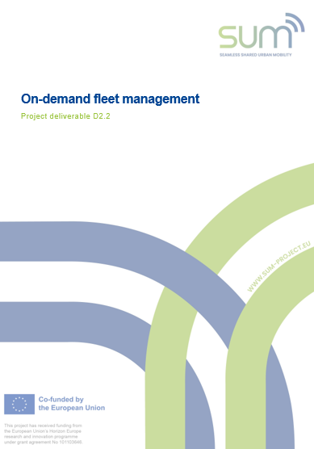

This repository holds the simulation-optimization framework version referred to in the Task 2.2 Deliverable, *On-demand fleet management*, for the SUM Project (EU Horizon Europe research and innovation programme grant agreement No 101103646). Starting June 2025, development will proceed in the "main" branch using the current version of FleetPy referenced as a submodule. 

