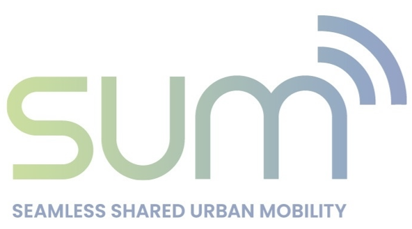

This repository holds the simulation-optimization framework for the SUM Project (EU Horizon Europe research and innovation programme grant agreement No 101103646).

The *T2.2-Deliverable* branch contains the code described in the May 2025 report for the SUM Project.

The *Main* branch will become the development branch starting in June 2025 with these goals: adding new features, easier to use, and staying current with advances in [FleetPy](https://github.com/TUM-VT/FleetPy). 

